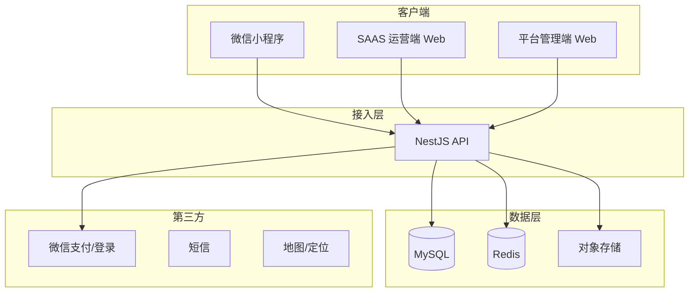

# 系统架构设计

## 1. 总体架构



## 2. 多租户模型（SaaS）

| 实体 | 说明 |
|------|------|
| `Platform` | 平台方，唯一 |
| `Tenant` | 租户（运营商），绑定城市/区域 |
| `Community` | 小区，归属租户，配置是否开通服务、定价 |
| `Rider` | 骑手/代收员，归属租户 |
| `User` | C 端微信用户，可跨租户下单（按小区归属租户） |

**数据隔离**：所有业务表带 `tenant_id`；API 通过 JWT 中的 `tenantId` + 中间件注入查询条件。

## 3. 订单状态机

```
pending_payment → paid → assigned → picked_up → disposed → completed
                      ↘ cancelled / refunded
```

| 状态 | 说明 |
|------|------|
| `pending_payment` | 待支付 |
| `paid` | 已支付，待派单 |
| `assigned` | 已派给骑手 |
| `picked_up` | 骑手已取袋 |
| `disposed` | 已投放到指定桶/点 |
| `completed` | 用户确认或超时自动完成 |
| `cancelled` | 已取消 |

## 4. 垃圾类型与定价

| 类型 code | 名称 | 计价方式 |
|-----------|------|----------|
| `kitchen` | 餐厨垃圾 | 元/袋，默认 3kg/袋 |
| `other` | 其他垃圾 | 元/袋 |
| `bulky` | 大件垃圾 | 按件报价（床、衣柜等） |
| `recyclable` | 可回收物 | 回收价（平台付给用户） |

定价优先级：`Community` 自定义 > `Tenant` 默认 > `Platform` 全局默认。

## 5. 角色与权限

| 角色 | 端 | 权限概要 |
|------|-----|----------|
| `user` | 小程序 | 下单、查看自己的订单 |
| `tenant_admin` | SAAS | 本租户全部业务数据 |
| `tenant_operator` | SAAS | 派单、订单处理，无财务/配置 |
| `rider` | 小程序骑手端 / SAAS | 接单、更新订单状态 |
| `platform_admin` | 管理端 | 租户 CRUD、全局配置 |
| `platform_ops` | 管理端 | 只读大盘、工单 |

## 6. 技术选型

| 层级 | 技术 | 理由 |
|------|------|------|
| 小程序 | 原生微信小程序 | 支付、订阅消息、体验最佳 |
| API | NestJS + TypeORM | 模块化、适合 SaaS 多模块 |
| SAAS/Admin | Vue 3 + Vite + Element Plus | 国内生态成熟、上手快 |
| DB | MySQL 8 | 事务、报表友好 |
| 缓存 | Redis | 会话、派单锁、限流 |

## 7. 一期 MVP 范围

- [x] 项目骨架与 API 契约
- [ ] 微信登录 + 手机号
- [ ] 下单 + 微信支付（沙箱）
- [ ] SAAS：小区配置、订单列表、手动派单
- [ ] 管理端：租户开通
- [ ] 骑手端（可二期合并到小程序分包）

## 8. 合规提示

- 用户需**自行完成垃圾分类**，小程序下单页需明确提示
- 代扔属于本地生活服务，需营业执照、可能与物业/街道合作
- 收集用户信息需隐私政策与用户协议
- 微信支付需企业主体与相应类目
